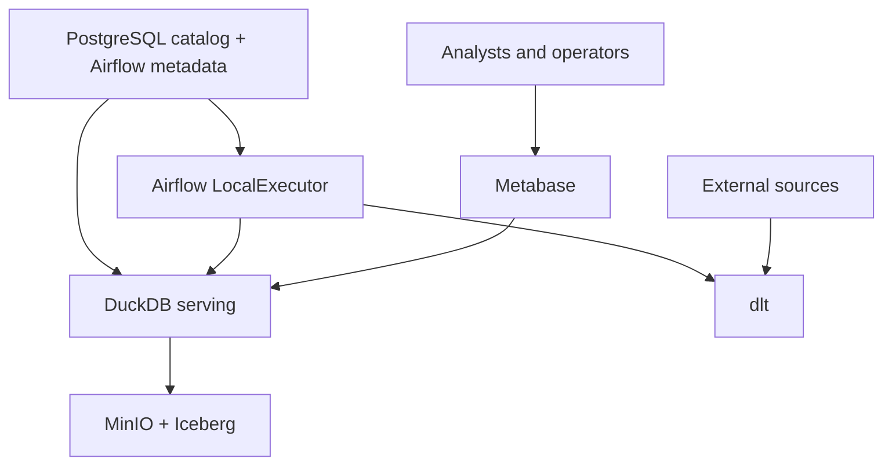
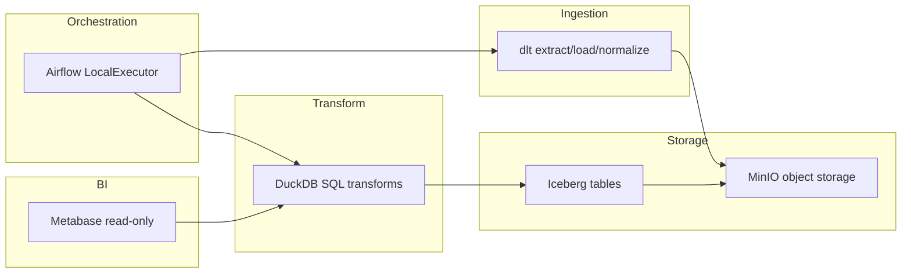
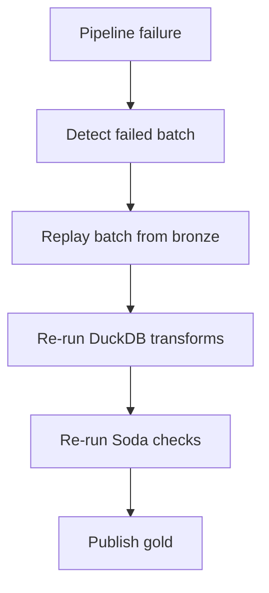

# Canonical Architecture

## Purpose

Kest is a single-node, production-capable lean lakehouse optimized for storage-first design, open table formats, low operational burden, and future compute portability. It is intentionally minimal and avoids distributed systems.

## System scope

In scope:
- Ingestion from APIs, files, and web sources.
- Immutable bronze storage on MinIO.
- Silver and gold transforms with DuckDB.
- Apache Iceberg tables on MinIO.
- Airflow LocalExecutor orchestration.
- Metabase BI access via DuckDB.
- Soda Core quality checks.
- Replayability, idempotency, and recovery.

Out of scope:
- Distributed execution engines.
- Streaming platforms.
- Heavy orchestration stacks.
- Metadata platforms.

## Architecture principles

1. Storage-first: Iceberg tables in MinIO are the primary asset.
2. Compute is disposable: DuckDB can be replaced without data migration.
3. Bronze is immutable: append-only, never overwrite.
4. Orchestration only: Airflow schedules and coordinates; business logic stays in transforms.
5. Strict dlt boundary: dlt only extracts, loads, and normalizes.
6. Single-node safety: avoid unnecessary services and concurrency.

## Service responsibilities

- MinIO: object storage for bronze, silver, gold, checkpoints, and temp.
- Iceberg: table format for silver and gold data.
- PostgreSQL: Iceberg catalog and Airflow metadata.
- dlt: extract, load, normalize, checkpoint, schema evolution support; no business transforms.
- DuckDB: silver and gold transforms, analytics serving, and marts.
- Airflow LocalExecutor: orchestration only.
- Metabase: read-only BI from curated gold tables via DuckDB.
- Soda Core: data quality checks for bronze, silver, gold gates.

## Hard boundary rules

- dlt must not perform business transformations.
- Bronze is append-only and immutable; no overwrite or delete.
- Airflow must not embed business logic; it triggers pipelines only.
- Metabase reads gold only via DuckDB; no bronze/silver access.

## Data lifecycle

1. dlt extracts from sources, normalizes, and loads raw data.
2. Bronze data lands in MinIO as immutable, append-only objects.
3. DuckDB reads bronze and produces silver Iceberg tables.
4. DuckDB produces gold marts and aggregates in Iceberg.
5. Metabase queries gold tables via DuckDB.
6. Soda Core validates bronze, silver, gold with escalating checks.

```mermaid
flowchart LR
  source[Sources: APIs, files, web] --> dlt[dlt ingestion]
  dlt --> bronze[MinIO bronze (immutable)]
  bronze --> duckdb[DuckDB transforms]
  duckdb --> silver[Iceberg silver on MinIO]
  duckdb --> gold[Iceberg gold on MinIO]
  gold --> metabase[Metabase via DuckDB]
  airflow[Airflow LocalExecutor] --> dlt
  airflow --> duckdb
  soda[Soda Core checks] --> bronze
  soda --> silver
  soda --> gold
```

## System context



## Service boundaries



## Recovery model

- Bronze is immutable, so any batch can be replayed without destructive changes.
- dlt checkpoints define last successful ingestion per source.
- DuckDB transforms are deterministic and can be re-run from bronze or silver.
- Postgres catalog state is required to resolve Iceberg table metadata.



## Failure domains

- Source failures: upstream API/file outages or schema drift.
- Ingestion failures: dlt retries and checkpoint errors.
- Storage failures: MinIO disk issues, bucket permissions.
- Catalog failures: PostgreSQL loss impacts Iceberg metadata.
- Transform failures: DuckDB SQL errors or resource limits.
- BI failures: Metabase connectivity or permissions.

## Backup priorities

1. PostgreSQL (first priority): Iceberg catalog and Airflow metadata.
2. MinIO (second priority): Iceberg data and bronze objects.
3. DuckDB (stateless): runtime only, no long-term state.

## Future evolution strategy

- Replace DuckDB with larger engines (e.g., Trino) without data migration.
- Add streaming later without changing storage or table format.
- Add metadata platforms only if operationally justified.

## Acceptance criteria

- Storage and compute are decoupled.
- Bronze is replayable and append-only.
- Transformations are deterministic.
- Failures are recoverable and idempotent.
- The stack evolves without data migration.
- The entire platform runs comfortably on a single node.
- No unnecessary distributed systems are introduced.
